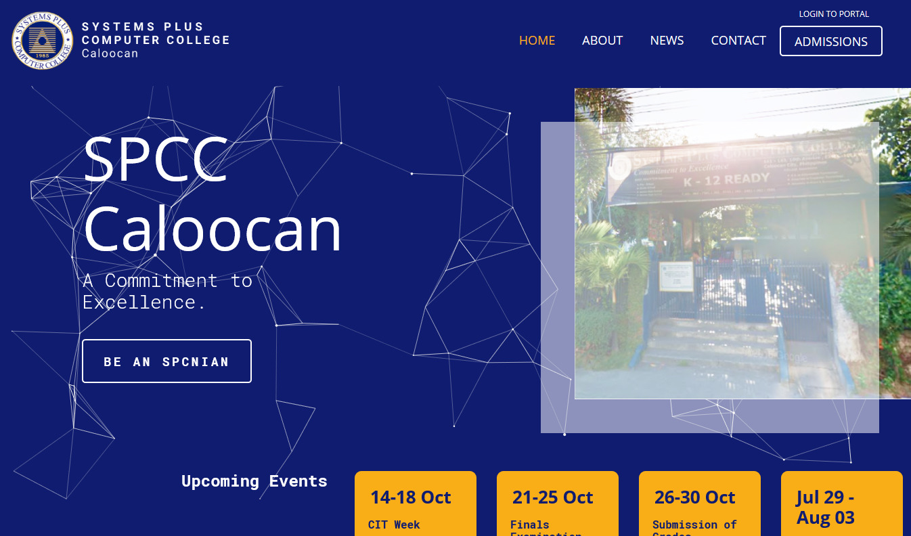

# SPCC Portal



An electronic grading web application, integrated with a school website, built using Laravel and Bootstrap. A capstone project for the Bachelor's Degree of Information Technology in SPCC - Caloocan.

## Case Study

Coming soon.

## Pre-requisite

-   [XAMPP](https://www.apachefriends.org/download.html)
-   [NPM](https://nodejs.org/en/download/)
-   [Git / Git Bash](https://git-scm.com/downloads)
-   [Composer](https://getcomposer.org/download/)
-   Familiar with mySQL and PHP

## Installation

1. [Clone the Repository](#clone-repo)
2. [Setting up a Virtual Host](#vhost)
3. [Database Configuration](#database)
4. [Populating the Database with some dummy data (optional)](#seeder)
5. [Check the App](#check)

### 1. Clone the Repository <a name="clone-repo"></a>

a. Go to `C:/xampp/htdocs`

```bash
cd 'C:/xampp/htdocs'
```

b. Clone the Repository

```bash
git clone https://github.com/jorenrui/spccweb.git
```

c. Go to the `spccweb` directory

```bash
cd 'spccweb'
```

d. Install Dependencies

```bash
composer install
```

### 2. Setting up a Virtual Host <a name="vhost"></a>

a. Go to `C:/xampp/apache/conf/extra/httpd-vhosts.conf`. Edit then save.

```
# At the bottom of the file

<VirtualHost *:80>
    DocumentRoot "C:/xampp/htdocs"
    ServerName localhost
</VirtualHost>

<VirtualHost *:80>
    DocumentRoot "C:/xampp/htdocs/spccweb/public"
    ServerName spccweb.me
</VirtualHost>
```

b. Open Notepad as **Administrator**. Then Open File: `C:/Windows/System32/drivers/etc/hosts`. Edit then save.

```
# At the bottom of the file

127.0.0.1 localhost
127.0.0.1 spccweb.me
```

### 3. Database Configuration <a name="database"></a>

a. Run both `Apache` and `mySQL` in the XAMPP Control Panel.

b. Go to `localhost/phpmyadmin` in your browser. Then login and create a database named `spcc`. In the main directory of `spccweb`, find `.env.example`. Open it and update the database information below. After that, save it as `.env`.

> **Note**
>
> The default credentials for the phpMyAdmin are:
>
> username: root
>
> password:
>
> _You can leave the password blank._

```
APP_NAME='SPCC Caloocan'
...
DB_DATABASE=spcc
DB_USERNAME=myUsername
DB_PASSWORD=myPassword
```

c. Generate the Application Key

```bash
php artisan key:generate
```

d. Reset the Database if you have already ran the Database Migration at least once, else proceed to the next step.

```bash
php artisan migrate:reset
```

e. Run the Database Migration

```
php artisan migrate
```

### 4. Populating the Database with some dummy data (optional) <a name="seeder"></a>

a. Populate the Database by running the Database Seeder. A dummy data has been provided.

```
composer dump-autoload
```

```
php artisan db:seed
```

b. Create a symbolic link:

```bash
php artisan storage:link
```

c. In the root directory of the repository, go to `public/img`. Copy both `cover_images` and `profile_pictures` to `public/storage/`.

d After that you're all set! You may now use the dummy accounts.

#### Dummy Accounts

**Admin**

username: admin

password: secret

**Head Registrar**

username & password: K002

**Registrar**

username & password: K003

**Faculty** (K004-K006)

username & password: K004

**Student** (042030001-042030006)

username & password: 042030001

### 5. Check the App <a name="check"></a>

a. Open a browser and go to `spccweb.me`. Make sure that both `Apache` and `MySQL` are running on the XAMPP Control Panel.

b. Try to login.

c. Congrats! You're all set.

## Installation with docker

a. With docker and docker-compose installed just run:

```
docker composer up -d
```

b. Install Dependencies:

```
docker exec -it spccweb-app composer install
```

c. Copy the `env.example` to `.env` and configure database access:

```
docker exec -it spccweb-app cp .env.example .env
```

d. Generate the Application Key:

```
docker exec -it spccweb-app php artisan key:generate
```

e. Run the Database Migration:

```
docker exec -it spccweb-app php artisan migrate
```

f. Populate the Database by running the Database Seeder (if any);

```
docker exec -it spccweb-app php artisan db:seed
```

g. Check the app:

-   Open a browser and go to localhost:8000

-   Try to login.

-   Congrats! You're all set.
